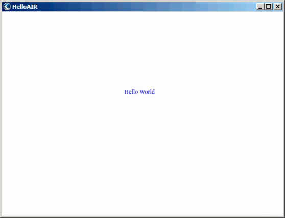

# Creating your first desktop AIR application using Flash Professional

For a quick, hands-on demonstration of how Adobe® AIR® works, follow the
instructions in this topic to create and package a simple "Hello World" AIR
application using Adobe® Flash® Professional.

If you haven't already done so, download and install Adobe AIR, which is located
here: [www.adobe.com/go/air](http://www.adobe.com/go/air).

## Create the Hello World application in Flash

Creating an Adobe AIR application in Flash is much like creating any other FLA
file. The following procedure guides you through the process of creating a
simple Hello World application using Flash Professional.

#### To create the Hello World application

1.  Start Flash.

2.  In the Welcome Screen, click AIR to create an empty FLA file with Adobe AIR
    publish settings.

3.  Select the Text tool in the Tools panel and create a static text field (the
    default) in the center of the Stage. Make it wide enough to contain 15 -20
    characters.

4.  Enter the text "Hello World" in the text field.

5.  Save the file, giving it a name (for example, HelloAIR).

## Test the application

1.  Press Ctrl + Enter or select Control -\>Test Movie-\>Test to test the
    application in Adobe AIR.

2.  To use the Debug Movie feature, first add ActionScript code to the
    application. You can try it quickly by adding a trace statement like the
    following:

        trace("Running AIR application using Debug Movie");

3.  Press Ctrl + Shift + Enter, or select Debug-\>Debug Movie-\>Debug to run the
    application with Debug Movie.

The Hello World application looks like this illustration:

## Package the application

1.  Select File \> Publish.

2.  Sign the Adobe AIR package with an existing digital certificate or create a
    self-signed certificate using the following steps:

    1.  Click the New button next to the Certificate field.

    2.  Complete the entries for Publisher name, Organizational unit,
        Organizational name, E-mail, Country, Password, and Confirm Password.

    3.  Specify the type of certificate. The certificate Type option refers to
        the level of security: 1024-RSA uses a 1024-bit key (less secure), and
        2048-RSA uses a 2048-bit key (more secure).

    4.  Save the information in a certificate file by completing the Save as
        entry or clicking the Browse... button to browse to a folder location.
        (For example, _C:/Temp/mycert.pfx_). When you're finished click OK.

    5.  Flash returns you to the Digital Signature Dialog. The path and filename
        of the self-signed certificate that you created appears in the
        Certificate text box. If not, enter the path and filename or click the
        Browse button to locate and select it.

    6.  Enter the same password in the Password text field of the Digital
        Signature dialog box as the password that you assigned in step b. For
        more information about signing your Adobe AIR applications, see
        [Digitally signing an AIR file](WS5b3ccc516d4fbf351e63e3d118666ade46-7ff0.html).

3.  To create the application and installer file, click the Publish button. (In
    Flash CS4 and CS5, click the OK button.) You must execute Test Movie or
    Debug Movie to create the SWF file and application.xml files before creating
    the AIR file.

4.  To install the application, double click the AIR file (_application_.air) in
    the same folder where you saved your application.

5.  Click the Install button in the Application Install dialog.

6.  Review the Installation Preferences and Location settings and make sure that
    the 'Start application after installation' checkbox is checked. Then click
    Continue.

7.  Click Finish when the Installation Completed message appears.
