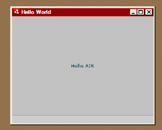

# Creating your first desktop AIR application with the Flex SDK

For a quick, hands-on illustration of how Adobe® AIR® works, use these
instructions to create a simple SWF-based AIR "Hello World" application using
the Flex SDK. This tutorial shows how to compile, test, and package an AIR
application with the command-line tools provided with the Flex SDK (the Flex SDK
includes the AIR SDK).

To begin, you must have installed the runtime and set up Adobe® Flex™. This
tutorial uses the _AMXMLC_ compiler, the _AIR Debug Launcher_ (ADL), and the
_AIR Developer Tool_ (ADT). These programs can be found in the `bin` directory
of the Flex SDK (see
[Setting up the Flex SDK](WS2d8d13466044a733190f0432124114d9a19-8000.html)).

## Create the AIR application descriptor file

This section describes how to create the application descriptor, which is an XML
file with the following structure:

    <application xmlns="...">
        <id>...</id>
        <versionNumber>...</versionNumber>
        <filename>…</filename>
        <initialWindow>
            <content>…</content>
            <visible>…</visible>
            <width>…</width>
            <height>…</height>
        </initialWindow>
    </application>

1.  Create an XML file named `HelloWorld-app.xml` and save it in the project
    directory.

2.  Add the `<application>` element, including the AIR namespace attribute:

    **\<application xmlns="http://ns.adobe.com/air/application/2.7"\>** The last
    segment of the namespace, "2.7," specifies the version of the runtime
    required by the application.

3.  Add the `<id>` element:

    **\<id\>samples.flex.HelloWorld\</id\>** The application ID uniquely
    identifies your application along with the publisher ID (which AIR derives
    from the certificate used to sign the application package). The recommended
    form is a dot-delimited, reverse-DNS-style string, such as
    `"com.company.AppName"`. The application ID is used for installation, access
    to the private application file-system storage directory, access to private
    encrypted storage, and interapplication communication.

4.  Add the `<versionNumber>` element:

    **\<versionNumber\>1.0\</versionNumber\>** Helps users to determine which
    version of your application they are installing.

    Note: If you are using AIR 2, or earlier, you must use the `<version>`
    element instead of the `<versionNumber>` element.

5.  Add the `<filename>` element:

    **\<filename\>HelloWorld\</filename\>** The name used for the application
    executable, install directory, and similar for references in the operating
    system.

6.  Add the `<initialWindow>` element containing the following child elements to
    specify the properties for your initial application window:

    **\<content\>HelloWorld.swf\</content\>** Identifies the root SWF file for
    AIR to load.

    **\<visible\>true\</visible\>** Makes the window visible immediately.

    **\<width\>400\</width\>** Sets the window width (in pixels).

    **\<height\>200\</height\>** Sets the window height.

7.  Save the file. Your complete application descriptor file should look like
    this:

        <?xml version="1.0" encoding="UTF-8"?>
        <application xmlns="http://ns.adobe.com/air/application/2.7">
            <id>samples.flex.HelloWorld</id>
            <versionNumber>0.1</versionNumber>
            <filename>HelloWorld</filename>
            <initialWindow>
                <content>HelloWorld.swf</content>
                <visible>true</visible>
                <width>400</width>
                <height>200</height>
            </initialWindow>
        </application>

This example only sets a few of the possible application properties. For the
full set of application properties, which allow you to specify such things as
window chrome, window size, transparency, default installation directory,
associated file types, and application icons, see
[AIR application descriptor files](WS5b3ccc516d4fbf351e63e3d118666ade46-7ff1.html)

## Write the application code

Note: SWF-based AIR applications can use a main class defined either with MXML
or with Adobe® ActionScript® 3.0. This example uses an MXML file to define its
main class. The process for creating an AIR application with a main ActionScript
class is similar. Instead of compiling an MXML file into the SWF file, you
compile the ActionScript class file. When using ActionScript, the main class
must extend flash.display.Sprite.

Like all Flex-based applications, AIR applications built with the Flex framework
contain a main MXML file. Desktop AIR applications, use the
_WindowedApplication_ component as the root element instead of the Application
component. The WindowedApplication component provides properties, methods, and
events for controlling your application and its initial window. On platforms and
profiles for which AIR doesn't support multiple windows, continue to use the
Application component. In mobile Flex applications, you can also use the View or
TabbedViewNavigatorApplication components.

The following procedure creates the Hello World application:

1.  Using a text editor, create a file named `HelloWorld.mxml` and add the
    following MXML code:

        <?xml version="1.0" encoding="utf-8"?>
        <s:WindowedApplication xmlns:fx="http://ns.adobe.com/mxml/2009"
                               xmlns:s="library://ns.adobe.com/flex/spark"
                               xmlns:mx="library://ns.adobe.com/flex/mx"
                               title="Hello World">
        </s:WindowedApplication>

2.  Next, add a Label component to the application (place it inside the
    WindowedApplication tag).

3.  Set the `text` property of the Label component to `"Hello AIR".`

4.  Set the layout constraints to always keep it centered.

    The following example shows the code so far:

        <?xml version="1.0" encoding="utf-8"?>
        <s:WindowedApplication xmlns:fx="http://ns.adobe.com/mxml/2009"
                               xmlns:s="library://ns.adobe.com/flex/spark"
                               xmlns:mx="library://ns.adobe.com/flex/mx"
                               title="Hello World">

            <s:Label text="Hello AIR" horizontalCenter="0" verticalCenter="0"/>
        </s:WindowedApplication>

## Compile the application

Before you can run and debug the application, compile the MXML code into a SWF
file using the amxmlc compiler. The amxmlc compiler can be found in the `bin`
directory of the Flex SDK. If desired, you can set the path environment of your
computer to include the Flex SDK bin directory. Setting the path makes it easier
to run the utilities on the command line.

1.  Open a command shell or a terminal and navigate to the project folder of
    your AIR application.

2.  Enter the following command:

        amxmlc HelloWorld.mxml

Running `amxmlc` produces `HelloWorld.swf`, which contains the compiled code of
the application.

Note: If the application does not compile, fix syntax or spelling errors. Errors
and warnings are displayed in the console window used to run the amxmlc
compiler.

For more information, see
[Compiling MXML and ActionScript source files for AIR](WS2d929364fa0b8137-4622b98b129dc3cff3f-7ffe.html).

## Test the application

To run and test the application from the command line, use the AIR Debug
Launcher (ADL) to launch the application using its application descriptor file.
(ADL can be found in the bin directory of the Flex SDK.)

 From the command prompt, enter the following command:

    adl HelloWorld-app.xml

The resulting AIR application looks something like this illustration:

Using the horizontalCenter and verticalCenter properties of the Label control,
the text is placed in the center of the window. Move or resize the window as you
would any other desktop application.

For more information, see
[AIR Debug Launcher (ADL)](WSfffb011ac560372f-6fa6d7e0128cca93d31-8000.html).

## Create the AIR installation file

When your application runs successfully, you can use the ADT utility to package
the application into an AIR installation file. An AIR installation file is an
archive file that contains all the application files, which you can distribute
to your users. You must install Adobe AIR before installing a packaged AIR file.

To ensure application security, all AIR installation files must be digitally
signed. For development purposes, you can generate a basic, self-signed
certificate with ADT or another certificate generation tool. You can also buy a
commercial code-signing certificate from a commercial certification authority.
When users install a self-signed AIR file, the publisher is displayed as
"unknown" during the installation process. This is because a self-signed
certificate only guarantees that the AIR file has not been changed since it was
created. There is nothing to prevent someone from self-signing a masquerade AIR
file and presenting it as your application. For publicly released AIR files, a
verifiable, commercial certificate is strongly recommended. For an overview of
AIR security issues, see
[AIR security](http://help.adobe.com/en_US/as3/dev/WS5b3ccc516d4fbf351e63e3d118666ade46-7fa3.html)
(for ActionScript developers) or
[AIR security](http://help.adobe.com/en_US/air/html/dev/WS5b3ccc516d4fbf351e63e3d118a9b90204-7d23.html)
(for HTML developers).

#### Generate a self-signed certificate and key pair

 From the command prompt, enter the following command
(the ADT executable can be found in the `bin` directory of the Flex SDK):

    adt -certificate -cn SelfSigned 1024-RSA sampleCert.pfx samplePassword

This example uses the minimum number of attributes that can be set for a
certificate. The key type must be either _1024-RSA_ or _2048-RSA_ (see
[Signing AIR applications](WSfffb011ac560372f-19aa73f128cc9f05e8-8000.html)).

#### Create the AIR package

 From the command prompt, enter the following command (on
a single line):

    adt -package -storetype pkcs12 -keystore sampleCert.pfx HelloWorld.air
    HelloWorld-app.xml HelloWorld.swf

You will be prompted for the keystore file password. Type the password and press
Enter. The password characters are not displayed for security reasons.

The HelloWorld.air argument is the AIR file that ADT produces.
HelloWorld-app.xml is the application descriptor file. The subsequent arguments
are the files used by your application. This example only uses three files, but
you can include any number of files and directories.

After the AIR package is created, you can install and run the application by
double-clicking the package file. You can also type the AIR filename as a
command in a shell or command window.

For more information, see
[Packaging a desktop AIR installation file](WS5b3ccc516d4fbf351e63e3d118666ade46-7f66.html).
