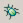
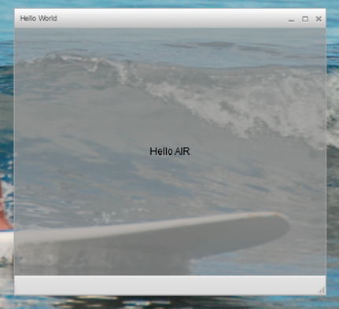

<h1>Creating your first desktop Flex AIR application in Flash Builder</h1>

	
For a quick, hands-on illustration
		of how Adobe® AIR® works, use these instructions to create and package
		a simple SWF file-based AIR “Hello World” application using Adobe®
		Flash® Builder. 

	
If you haven’t already done so, download and install Flash Builder.
		Also, download and install the most recent version of Adobe AIR,
		which is located here: <a href="http://www.adobe.com/go/air">www.adobe.com/go/air</a>.

	<ul></ul>

	<h2>Create an AIR project</h2>
	

		
Flash
			Builder includes tools to develop and package AIR applications.

		
You begin to create AIR applications in Flash Builder or Flex
			Builder in the same way that you create other Flex-based application
			projects: by defining a new project. 

		<ol>
			<li>
				
Open Flash Builder.

			</li>
			<li>
				
Select File &gt; New &gt; Flex Project. 

			</li>
			<li>
				
Enter the project name as AIRHelloWorld. 

			</li>
			<li>
				
In Flex, AIR applications are considered an application type.
					You have two type options:

				<ul>
					<li>
						
a web application that
							runs in Adobe® Flash® Player

					</li>
					<li>
						
a desktop application that runs in Adobe AIR

					</li>
				</ul>
				
Select
					Desktop as the application type. 

			</li>
			<li>
				
Click Finish to create the project.

			</li>
		</ol>
		
AIR projects initially consist of two files: the main MXML file
			and an application XML file (known as the application descriptor
			file). The latter file specifies application properties. 

		
For more information, see <a
				href="http://help.adobe.com/en_US/Flex/4.0/UsingFlashBuilder/WS6b84a753ecd210fd-7fb8a08d12114b6a4cf-8000.html">Developing
				AIR applications with Flash Builder</a>.

	

	<h2>Write the AIR application code</h2>
	

		
To write the “Hello World” application code, you edit the
			application MXML file (AIRHelloWorld.mxml), which is open in the
			editor. (If the file isn't open, use the Project Navigator to open
			the file.) 

		
Flex AIR applications on the desktop are contained within the
			MXML WindowedApplication tag. The MXML WindowedApplication tag creates
			a simple window that includes basic window controls such as a title
			bar and close button. 

		<ol>
			<li>
				
Add a <samp>title</samp> attribute to the WindowedApplication
					component, and assign it the value <samp>"Hello World"</samp>:

				<pre>&lt;?xml version="1.0" encoding="utf-8"?&gt; 
&lt;s:WindowedApplication xmlns:fx="http://ns.adobe.com/mxml/2009" 
                       xmlns:s="library://ns.adobe.com/flex/spark" 
                       xmlns:mx="library://ns.adobe.com/flex/mx" 
                       title="Hello World"&gt; 
&lt;/s:WindowedApplication&gt;</pre>
			</li>
			<li>
				
Add a Label component to the application (place it inside
					the WindowedApplication tag). Set the <samp>text</samp> property
					of the Label component to <samp>"Hello AIR"</samp>, and set
					the layout constraints to keep it centered, as shown here:

				<pre>&lt;?xml version="1.0" encoding="utf-8"?&gt; 
&lt;s:WindowedApplication xmlns:fx="http://ns.adobe.com/mxml/2009" 
                       xmlns:s="library://ns.adobe.com/flex/spark" 
                       xmlns:mx="library://ns.adobe.com/flex/mx" 
                       title="Hello World"&gt; 
 
    &lt;s:Label text="Hello AIR" horizontalCenter="0" verticalCenter="0"/&gt; 
&lt;/s:WindowedApplication&gt;</pre>
			</li>
			<li>
				
Add the following style block immediately after the opening
					WindowedApplication tag and before the label component tag you just
					entered:

				<pre>&lt;fx:Style&gt; 
    @namespace s "library://ns.adobe.com/flex/spark"; 
    s|WindowedApplication 
    { 
     
skinClass:ClassReference("spark.skins.spark.SparkChromeWindowedApplicationSkin"); 
        background-color:#999999; 
        background-alpha:"0.7"; 
    }          
&lt;/fx:Style&gt;</pre>
			</li>
		</ol>
		
These style settings apply to the entire application and render
			the window background a slightly transparent gray. 

		
The application code now looks like the following:

		<pre>&lt;?xml version="1.0" encoding="utf-8"?&gt; 
&lt;s:WindowedApplication xmlns:fx="http://ns.adobe.com/mxml/2009" 
                       xmlns:s="library://ns.adobe.com/flex/spark" 
                       xmlns:mx="library://ns.adobe.com/flex/mx" 
                       title="Hello World"&gt; 
     
    &lt;fx:Style&gt; 
        @namespace s "library://ns.adobe.com/flex/spark"; 
        s|WindowedApplication 
        { 
         
skinClass:ClassReference("spark.skins.spark.SparkChromeWindowedApplicationSkin"); 
            background-color:#999999; 
            background-alpha:"0.7"; 
        }          
    &lt;/fx:Style&gt; 
 
    &lt;s:Label text="Hello AIR" horizontalCenter="0" verticalCenter="0"/&gt; 
&lt;/s:WindowedApplication&gt;</pre>
		
Next, you will change some settings in the application descriptor
			to allow the application to be transparent:

		

			<ol>
				<li>
					
In the Flex Navigator pane, locate the application
						descriptor file in the source directory of the project. If you named
						your project AIRHelloWorld, this file is named AIRHelloWorld-app.xml.

				</li>
				<li>
					
Double-click the application descriptor file to edit it in
						Flash Builder.

				</li>
				<li>
					
In the XML code, locate the commented lines for the <samp>systemChrome</samp> and
						<samp>transparent</samp> properties
						(of the <samp>initialWindow</samp> property). Remove the comments.
						(Remove the <samp>"&lt;!--"</samp> and <samp>"--&gt;"</samp> comment
						delimiters.)

				</li>
				<li>
					
Set the text value of the <samp>systemChrome</samp> property
						to <samp>none</samp>, as in the following:

					<pre>&lt;systemChrome&gt;none&lt;/systemChrome&gt;</pre>
				</li>
				<li>
					
Set the text value of the <samp>transparent</samp> property
						to <samp>true</samp>, as in the following:

					<pre>&lt;transparent&gt;true&lt;/transparent&gt;</pre>
				</li>
				<li>
					
Save the file.

				</li>
			</ol>
		

	

	<h2>Test the AIR application</h2>
	

		
To test the application code that you’ve written, run it
			in debug mode. 

		<ol>
			<li>
				
Click the Debug button  in
					the main toolbar. 

				
You can also select the Run &gt; Debug
					&gt; AIRHelloWorld command.

				
The resulting AIR application
					should look like the following example: 

				

				

			</li>
			<li>
				
Using the <samp>horizontalCenter</samp> and <samp>verticalCenter</samp> properties
					of the Label control, the text is placed in the center of the window.
					Move or resize the window as you would any other desktop application. 

			</li>
		</ol>
		
Note: If the application does not compile, fix any
			syntax or spelling errors that you inadvertently entered into the
			code. Errors and warnings are displayed in the Problems view in
			Flash Builder. 

	

	<h2>Package, sign, and run your AIR application</h2>
	

		
You are now ready to package the "Hello World" application
			into an AIR file for distribution. An AIR file is an archive file
			that contains the application files, which are all of the files
			contained in the project’s bin folder. In this simple example, those
			files are the SWF and application XML files. You distribute the
			AIR package to users who then use it to install the application.
			A required step in this process is to digitally sign it. 

		<ol>
			<li>
				
Ensure that the application has no compilation errors
					and runs as expected. 

			</li>
			<li>
				
Select Project &gt; Export Release Build. 

			</li>
			<li>
				
Check that the AIRHelloWorld project and AIRHelloWorld.mxml
					application are listed for project and application. 

			</li>
			<li>
				
Select Export as signed AIR package option. Then click Next.

			</li>
			<li>
				
If you have an existing digital certificate, click Browse
					to locate and select it. 

			</li>
			<li>
				
If you must create a new self-signed digital certificate,
					select Create. 

			</li>
			<li>
				
Enter the required information and click OK. 

			</li>
			<li>
				
Click Finish to generate the AIR package, which is named
					AIRHelloWorld.air.

			</li>
		</ol>
		
You can now install and run the application from the Project
			Navigator in Flash Builder or from the file system by double-clicking
			the AIR file.

	

<!-- BEGIN USER PREFERENCES -->

<!-- END USER PREFERENCES -->

    
&nbsp;

