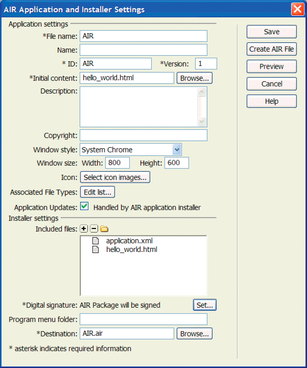

# Create your first HTML-based AIR application with Dreamweaver

For a quick, hands-on illustration of how Adobe® AIR® works, use these
instructions to create and package a simple HTML-based AIR "Hello World"
application using the Adobe® AIR® Extension for Dreamweaver®.

If you haven't already done so, download and install Adobe AIR, which is located
here: [www.adobe.com/go/air](http://www.adobe.com/go/air).

For instructions on installing the Adobe AIR Extension for Dreamweaver, see
[Install the AIR Extension for Dreamweaver](http://help.adobe.com/en_US/Dreamweaver/CS5/Using/WS6463f310bbfa3de2-1eb2a492126f73db0f1-8000.html#WS6463f310bbfa3de2474c13d1126f74475d2-7ffe).

For an overview of the extension, including system requirements, see
[AIR Extension for Dreamweaver](http://help.adobe.com/en_US/Dreamweaver/CS5/Using/WS6463f310bbfa3de2-1eb2a492126f73db0f1-8000.html).

Note: HTML-based AIR applications can only be developed for the desktop and the
extendedDesktop profiles. The mobile profile is not supported.

## Prepare the application files

Your Adobe AIR application must have a start page and all of its related pages
defined in a Dreamweaver site:

1.  Start Dreamweaver and make sure you have a site defined.

2.  Open a new HTML page by selecting File \> New, selecting HTML in the Page
    Type column, selecting None in the Layout column, and clicking Create.

3.  In the new page, type **Hello World!**

    This example is extremely simple, but if you want you can style the text to
    your liking, add more content to the page, link other pages to this start
    page, and so on.

4.  Save the page (File \> Save) as hello_world.html. Make sure you save the
    file in a Dreamweaver site.

For more information on Dreamweaver sites, see Dreamweaver Help.

## Create the Adobe AIR application

1.  Make sure you have the hello_world.html page open in the Dreamweaver
    Document window. (See the previous section for instructions on creating it.)

2.  Select Site \> Air Application Settings.

    Most of the required settings in the AIR Application and Settings dialog box
    are auto-populated for you. You must, however, select the initial content
    (or start page) of your application.

3.  Click the Browse button next to the Initial Content option, navigate to your
    hello_world.html page, and select it.

4.  Next to the Digital signature option, click the Set button.

    A digital signature provides an assurance that the code for an application
    has not been altered or corrupted since its creation by the software author,
    and is required on all Adobe AIR applications.

5.  In the Digital Signature dialog box, select Sign the AIR package with a
    digital certificate, and click the Create button. (If you already have
    access to a digital certificate, you can click the Browse button to select
    it instead.)

6.  Complete the required fields in the Self-Signed Digital Certificate dialog
    box. You'll need to enter your name, enter a password and confirm it, and
    enter a name for the digital certificate file. Dreamweaver saves the digital
    certificate in your site root.

7.  Click OK to return to the Digital Signature dialog box.

8.  In the Digital Signature dialog box, enter the password you specified for
    your digital certificate and click OK.

    Your completed AIR Application and Installer Settings dialog box might look
    like this:

    

    For further explanation about all of the dialog box options and how to edit
    them, see
    [Creating an AIR application in Dreamweaver](http://help.adobe.com/en_US/dreamweaver/cs/using/WS6463f310bbfa3de2-1eb2a492126f73db0f1-8000.html#WS6463f310bbfa3de2-1eb2a492126f73db0f1-7fff).

9.  Click the Create AIR File button.

    Dreamweaver creates the Adobe AIR application file and saves it in your site
    root folder. Dreamweaver also creates an application.xml file and saves it
    in the same place. This file serves as a manifest, defining various
    properties of the application.

## Install the application on a desktop

Now that you've created the application file, you can install it on any desktop.

1.  Move the Adobe AIR application file out of your Dreamweaver site and onto
    your desktop, or to another desktop.

    This step is optional. You can actually install the new application on your
    computer right from your Dreamweaver site directory if you prefer.

2.  Double-click the application executable file (.air file) to install the
    application.

## Preview the Adobe AIR application

You can preview pages that will be part of AIR applications at any time. That
is, you don't necessarily need to package the application before seeing what it
will look like when it's installed.

1.  Make sure your hello_world.html page is open in the Dreamweaver Document
    window.

2.  On the Document toolbar, click the Preview/Debug in Browser button, and then
    select Preview In AIR.

    You can also press Ctrl+Shift+F12 (Windows) or Cmd+Shift+F12 (Macintosh).

    When you preview this page, you are essentially seeing what a user would see
    as the start page of the application after they've installed the application
    on a desktop.
