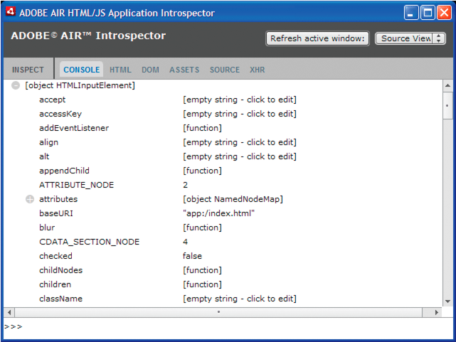
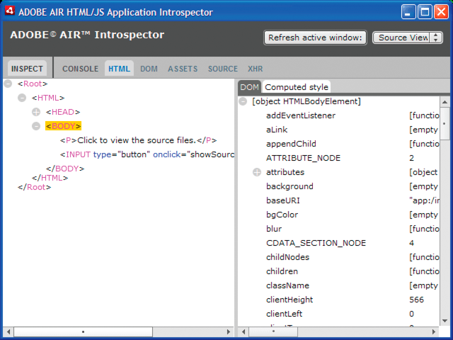
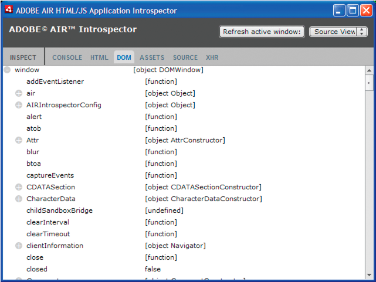
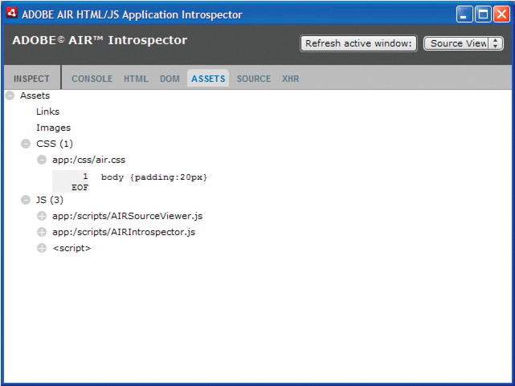
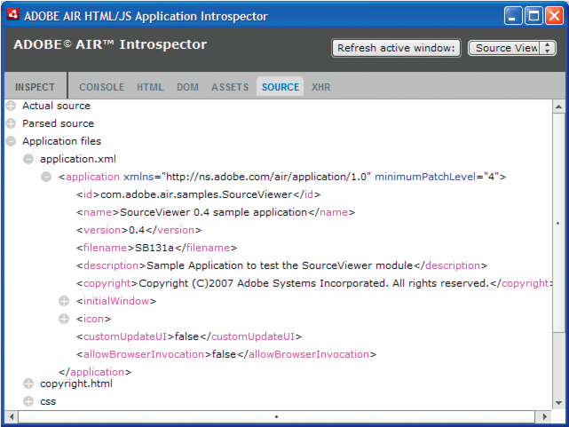
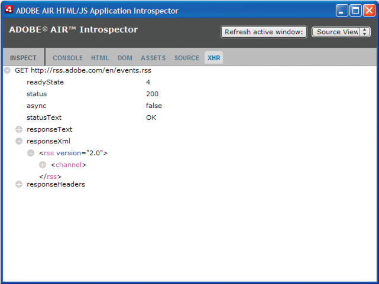

# Debugging with the AIR HTML Introspector

The Adobe® AIR® SDK includes an AIRIntrospector.js JavaScript file that you can
include in your application to help debug HTML-based applications.

## About the AIR Introspector

The Adobe AIR HTML/JavaScript Application Introspector (called the AIR HTML
Introspector) provides useful features to assist HTML-based application
development and debugging:

- It includes an introspector tool that allows you to point to a user interface
  element in the application and see its markup and DOM properties.

- It includes a console for sending objects references for introspection, and
  you can adjust property values and execute JavaScript code. You can also
  serialize objects to the console, which limits you from editing the data. You
  can also copy and save text from the console.

- It includes a tree view for DOM properties and functions.

- It lets you edit the attributes and text nodes for DOM elements.

- It lists links, CSS styles, images, and JavaScript files loaded in your
  application.

- It lets you view to the initial HTML source and the current markup source for
  the user interface.

- It lets you access files in the application directory. (This feature is only
  available for the AIR HTML Introspector console opened for application
  sandbox. Not available for the consoles open for non-application sandbox
  content.)

- It includes a viewer for XMLHttpRequest objects and their properties,
  including `responseText` and `responseXML` properties (when available).

- You can search for matching text in the source code and files.

## Loading the AIR Introspector code

The AIR Introspector code is included in a JavaScript file, AIRIntrospector.js,
that is included in the frameworks directory of the AIR SDK. To use the AIR
Introspector in your application, copy the AIRIntrospector.js to your
application project directory and load the file via a script tag in the main
HTML file in your application:

    

Also include the file in every HTML file that corresponds to different native
windows in your application.

Important: Include the AIRIntrospector.js file only when developing and
debugging the application. Remove it in the packaged AIR application that you
distribute.

The AIRIntrospector.js file defines a class, Console, which you can access from
JavaScript code by calling `air.Introspector.Console`.

> **Note:** Code using the AIR Introspector must be in the application security
> sandbox (in a file in the application directory).

## Inspecting an object in the Console tab

The Console class defines five methods: `log()`, `warn()`, `info()`, `error()`,
and `dump()`.

The `log()`, `warn()`, `info()`, and `error()` methods all let you send an
object to the Console tab. The most basic of these methods is the `log()`
method. The following code sends a simple object, represented by the `test`
variable, to the Console tab:

    var test = "hello";
    air.Introspector.Console.log(test);

However, it is more useful to send a complex object to the Console tab. For
example, the following HTML page includes a button (`btn1`) that calls a
function that sends the button object itself to the Console tab:

    <html>
        <head>
            <title>Source Viewer Sample</title>
            
            
        </head>
        <body>
            
Click to view the button object in the Console.

            <input type="button" id="btn1"
                onclick="logBtn()"
                value="Log" />
        </body>
    </html>

When you click the button, the Console tab displays the btn1 object, and you can
expand the tree view of the object to inspect its properties:

You can edit a property of the object by clicking the listing to the right of
the property name and modifying the text listing.

The `info()`, `error()`, and `warn()` methods are like the `log()` method.
However, when you call these methods, the Console displays an icon at the
beginning of the line:

<table>
<colgroup>
<col style="width: 50%" />
<col style="width: 50%" />
</colgroup>
<thead>
<tr class="header">
<th>
Method
</th>
<th>
Icon
</th>
</tr>
</thead>
<tbody>
<tr class="odd">
<td>
<samp>info()</samp>
</td>
<td>

</td>
</tr>
<tr class="even">
<td>
<samp>error()</samp>
</td>
<td>

</td>
</tr>
<tr class="odd">
<td>
<samp>warn()</samp>
</td>
<td>

</td>
</tr>
</tbody>
</table>

The `log()`, `warn()`, `info()`, and `error()` methods send a reference only to
an actual object, so the properties available are the ones at the moment of
viewing. If you want to serialize the actual object, use the `dump()` method.
The method has two parameters:

| Parameter    | Description                                                                                                                                                                                                             |
| ------------ | ----------------------------------------------------------------------------------------------------------------------------------------------------------------------------------------------------------------------- |
| `dumpObject` | The object to be serialized.                                                                                                                                                                                            |
| `levels`     | The maximum number of levels to be examined in the object tree (in addition to the root level). The default value is 1 (meaning that one level beyond the root level of the tree is shown). This parameter is optional. |

Calling the `dump()` method serializes an object before sending it to the
Console tab, so that you cannot edit the objects properties. For example,
consider the following code:

    var testObject = new Object();
    testObject.foo = "foo";
    testObject.bar = 234;
    air.Introspector.Console.dump(testObject);

When you execute this code, the Console displays the `testObject` object and its
properties, but you cannot edit the property values in the Console.

## Configuring the AIR Introspector

You can configure the console by setting properties of the global
`AIRIntrospectorConfig` variable. For example, the following JavaScript code
configures the AIR Introspector to wrap columns at 100 characters:

    var AIRIntrospectorConfig = new Object();
    AIRIntrospectorConfig.wrapColumns = 100;

Be sure to set the properties of the `AIRIntrospectorConfig` variable before
loading the AIRIntrospector.js file (via a `script` tag).

There are eight properties of the `AIRIntrospectorConfig` variable:

| Property                  | Default value     | Description                                                                                                                                  |
| ------------------------- | ----------------- | -------------------------------------------------------------------------------------------------------------------------------------------- |
| `closeIntrospectorOnExit` | `true`            | Sets the Inspector window to close when all other windows of the application are closed.                                                     |
| `debuggerKey`             | 123 (the F12 key) | The key code for the keyboard shortcut to show and hide the AIR Introspector window.                                                         |
| `debugRuntimeObjects`     | `true`            | Sets the Introspector to expand runtime objects in addition to objects defined in JavaScript.                                                |
| `flashTabLabels`          | `true`            | Sets the Console and XMLHttpRequest tabs to flash, indicating when a change occurs in them (for example, when text is logged in these tabs). |
| `introspectorKey`         | 122 (the F11 key) | The key code for the keyboard shortcut to open the Inspect panel.                                                                            |
| `showTimestamp`           | `true`            | Sets the Console tab to display timestamps at the beginning of each line.                                                                    |
| `showSender`              | `true`            | Sets the Console tab to display information on the object sending the message at the beginning of each line.                                 |
| `wrapColumns`             | 2000              | The number of columns at which source files are wrapped.                                                                                     |

## AIR Introspector interface

To open the AIR introspector window when debugging the application, press the
F12 key or call one of the methods of the Console class (see
[Inspecting an object in the Console tab](WS5b3ccc516d4fbf351e63e3d118666ade46-7f16.html)).
You can configure the hot key to be a key other than the F12 key; see
[Configuring the AIR Introspector](WS5b3ccc516d4fbf351e63e3d118666ade46-7f15.html).

The AIR Introspector window has six tabs—Console, HTML, DOM, Assets, Source, and
XHR—as shown in the following illustration:

#### The Console tab

The Console tab displays values of properties passed as parameters to one of the
methods of the air.Introspector.Console class. For details, see
[Inspecting an object in the Console tab](WS5b3ccc516d4fbf351e63e3d118666ade46-7f16.html).

- To clear the console, right-click the text and select Clear Console.

- To save text in the Console tab to a file, right-click the Console tab and
  select Save Console To File.

- To save text in the Console tab to the clipboard, right-click the Console tab
  and select Save Console To Clipboard. To copy only selected text to the
  clipboard, right-click the text and select Copy.

- To save text in the Console class to a file, right-click the Console tab and
  select Save Console To File.

- To search for matching text displayed in the tab, click CTRL+F on Windows or
  Command+F on Mac OS. (Tree nodes that are not visible are not searched.)

#### The HTML tab

The HTML tab lets you view the entire HTML DOM in a tree structure. Click an
element to view its properties on the right side of the tab. Click the + and -
icons to expand and collapse a node in the tree.

You can edit any attribute or text element in the HTML tab and the edited value
is reflected in the application.

Click the Inspect button (to the left of the list of tabs in the AIR
Introspector window). You can click any element on the HTML page of the main
window and the associated DOM object is displayed in the HTML tab. When the main
window has focus, you can also press the keyboard shortcut to toggle the Inspect
button on and off. The keyboard shortcut is F11 by default. You can configure
the keyboard shortcut to be a key other than the F11 key; see
[Configuring the AIR Introspector](WS5b3ccc516d4fbf351e63e3d118666ade46-7f15.html).

Click the Refresh Active Window button (at the top of the AIR Introspector
window) to refresh the data displayed in the HTML tab.

Click CTRL+F on Windows or Command+F on Mac OS to search for matching text
displayed in the tab. (Tree nodes that are not visible are not searched.)

#### The DOM tab

The DOM tab shows the window object in a tree structure. You can edit any string
and numeric properties and the edited value is reflected in the application.

Click the Refresh Active Window button (at the top of the AIR Introspector
window) to refresh the data displayed in the DOM tab.

Click CTRL+F on Windows or Command+F on Mac OS to search for matching text
displayed in the tab. (Tree nodes that are not visible are not searched.)

#### The Assets tab

The Assets tab lets you check the links, images, CSS, and JavaScript files
loaded in the native window. Expanding one of these nodes shows the content of
the file or displays the actual image used.

Click the Refresh Active Window button (at the top of the AIR Introspector
window) to refresh the data displayed in the Assets tab.

Click CTRL+F on Windows or Command+F on Mac OS to search for matching text
displayed in the tab. (Tree nodes that are not visible are not searched.)

#### The Source tab

The Source tab includes three sections:

- Actual source—Shows the HTML source of the page loaded as the root content
  when the application started.

- Parsed source—Shows the current markup that makes up the application UI, which
  can be different from the actual source, since the application generates
  markup code on the fly using Ajax techniques.

- Application files—Lists the files in the application directory. This listing
  is only available for the AIR Introspector when launched from content in the
  application security sandbox. In this section, you can view the content of
  text files or view images.

Click the Refresh Active Window button (at the top of the AIR Introspector
window) to refresh the data displayed in the Source tab.

Click CTRL+F on Windows or Command+F on Mac OS to search for matching text
displayed in the tab. (Tree nodes that are not visible are not searched.)

#### The XHR tab

The XHR tab intercepts all XMLHttpRequest communication in the application and
logs the information. This lets you view the XMLHttpRequest properties including
`responseText` and `responseXML` (when available) in a tree view.

Click CTRL+F on Windows or Command+F on Mac OS to search for matching text
displayed in the tab. (Tree nodes that are not visible are not searched.)

## Using the AIR Introspector with content in a non-application sandbox

You can load content from the application directory into an iframe or frame that
is mapped to a non-application sandbox. (See
[HTML security in Adobe AIR](https://web.archive.org/web/20150414032840/http://help.adobe.com/en_US/as3/dev/WS5b3ccc516d4fbf351e63e3d118666ade46-7fa3.html#WS5b3ccc516d4fbf351e63e3d118666ade46-7f11)
for ActionScript developers or
[HTML security in Adobe AIR](https://web.archive.org/web/20150414032840/http://help.adobe.com/en_US/air/html/dev/WS5b3ccc516d4fbf351e63e3d118666ade46-7fa3.html#WS5b3ccc516d4fbf351e63e3d118666ade46-7f11)
for HTML developers). You can use the AIR introspector with such content, but
observe the following rules:

- The AIRIntrospector.js file must be included in both the application sandbox
  and in the non-application sandbox (the iframe) content.

- Do not overwrite the `parentSandboxBridge` property; the AIR Introspector code
  uses this property. Add properties as needed. So instead of writing the
  following:

      parentSandboxBridge = mytrace: function(str) {runtime.trace(str)}} ;

  Use syntax such as the following:

      parentSandboxBridge.mytrace = function(str) {runtime.trace(str)};

- From the non-application sandbox content, you cannot open the AIR Introspector
  by pressing the F12 key or by calling one of methods in the
  air.Introspector.Console class. You can open the Introspector window only by
  clicking the Open Introspector button. The button is added by default at the
  upper-right corner of the iframe or frame. (Due to security restrictions
  imposed to non-application sandbox content, a new window can be opened only as
  a result of a user gesture, such as clicking a button.)

- You can open separate AIR Introspector windows for the application sandbox and
  for the non-application sandbox. You can differentiate the two using the title
  displayed in the AIR Introspector windows.

- The Source tab doesn't display application files when the AIR Introspector is
  run from a non-application sandbox

- The AIR Introspector can only look at code in the sandbox from which it was
  opened.
