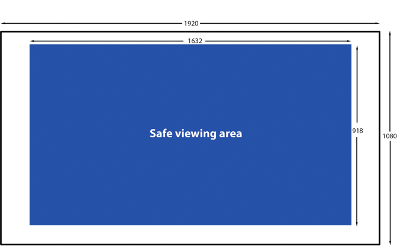

# AIR for TV application design considerations

## Video considerations

#### Video encoding guidelines

When streaming video to a TV device, Adobe recommends the following encoding
guidelines:

|                     |                                                                                                                                                      |
| ------------------- | ---------------------------------------------------------------------------------------------------------------------------------------------------- |
| Video codec:        | H.264, Main or High profile, progressive encoding                                                                                                    |
| Resolution:         | 720i, 720p, 1080i, or 1080p                                                                                                                          |
| Frame rate:         | 24 frames per second or 30 frames per second                                                                                                         |
| Audio codec:        | AAC-LC or AC-3, 44.1 kHz, stereo, or these multichannel audio codecs: E-AC-3, DTS, DTS Express, DTS-HD High Resolution Audio, or DTS-HD Master Audio |
| Combined bit rate:  | up to 8M bps depending on available bandwidth                                                                                                        |
| Audio bit rate:     | up to 192 Kbps                                                                                                                                       |
| Pixel aspect ratio: | 1 × 1                                                                                                                                                |

Adobe recommends that you use the H.264 codec for video delivered to AIR for TV
devices.

Note: AIR for TV also supports video that is encoded with Sorenson Spark or On2
VP6 codecs. However, the hardware does not decode and present these codecs.
Instead, the runtime decodes and presents these codecs using software, and
therefore, the video plays at a much lower frame rate. Therefore, use H.264 if
at all possible.

#### The StageVideo class

AIR for TV supports hardware decoding and presentation of H.264-encoded video.
Use the StageVideo class to enable this feature.

See
[Using the StageVideo class for hardware accelerated presentation](http://www.adobe.com/go/learn_as3_stageVideo_en)in
the _ActionScript 3.0 Developer’s Guide_ for details about:

- the API of the StageVideo class and related classes.

- limitations of using the StageVideo class.

To best support existing AIR applications that use the Video object for
H.264-encoded video, AIR for TV _internally_ uses a StageVideo object. Doing so
means the video playback benefits from hardware decoding and presentation.
However, the Video object is subject to the same restrictions as a StageVideo
object. For example, if the application tries to rotate the video, no rotation
occurs, since the hardware, not the runtime, is presenting the video.

However, when you write new applications, use the StageVideo object for
H.264-encoded video.

For an example of using the StageVideo class, see
[Delivering video and content for the Flash Platform on TV](http://www.adobe.com/go/learn_air_for_tv_article_en).

#### Video delivery guidelines

On an AIR for TV device, the network’s available bandwidth can vary during video
playback. These variations can occur, for example, when another user starts to
use the same Internet connection.

Therefore, Adobe recommends that your video delivery system use adaptive bitrate
capabilities. For example, on the server side, Flash Media Server supports
adaptive bitrate capabilities. On the client side, you can use the Open Source
Media Framework (OSMF).

The following protocols are available to deliver video content over the network
to an AIR for TV application:

- HTTP and HTTPS Dynamic Streaming (F4F format)

- RTMP, RTMPE, RTMFP, RTMPT, and RTMPTE Streaming

- HTTP and HTTPS Progressive Download

For more information, see the following:

- [Adobe Flash Media Server Developer's Guide](http://www.adobe.com/go/learn_fms_devguide_en)

- [Open Source Media Framework](http://www.opensourcemediaframework.com/)

## Audio considerations

The ActionScript for playing sound is no different in AIR for TV applications
than in other AIR applications. For information, see
[Working with sound](http://www.adobe.com/go/learn_as3_sound_en) in the
_ActionScript 3.0 Developer’s Guide_.

Regarding multichannel audio support in AIR for TV, consider the following:

- AIR for TV supports multichannel audio for videos that are progressively
  downloaded from an HTTP server. Support for multichannel audio in videos
  streamed from an Adobe Flash Media Server is not yet available.

- Although AIR for TV supports many audio codecs, not all AIR for TV **devices**
  support the entire set. Use the
  [flash.system.Capabilities](http://help.adobe.com/en_US/FlashPlatform/reference/actionscript/3/flash/system/Capabilities.html)
  method `hasMultiChannelAudio()`to check whether an AIR for TV device supports
  a particular multichannel audio codec such as AC-3.

  For example, consider an application that progressively downloads a video file
  from a server. The server has different H.264 video files that support
  different multichannel audio codecs. The application can use
  `hasMultiChannelAudio()`to determine which video file to request from the
  server. Alternatively, the application can send a server the string contained
  in `Capabilities.serverString`. The string indicates which multichannel audio
  codecs are available, allowing the server to select the appropriate video
  file.

- When using one of the DTS audio codecs, scenarios exist in which
  `hasMultiChannelAudio()` returns `true`, but the DTS audio is not played.

  For example, consider a Blu-ray player with an S/PDIF output, connected to an
  old amplifier. The old amplifier does not support DTS, but S/PDIF has no
  protocol to notify the Blu-ray player. If the Blu-ray player sends the DTS
  stream to the old amplifier, the user hears nothing. Therefore, as a best
  practice when using DTS, provide a user interface so that the user can
  indicate if no sound is playing. Then, your application can revert to a
  different codec.

The following table summarizes when to use different audio codecs in AIR for TV
applications. The table also indicates when AIR for TV devices use hardware
accelerators to decode an audio codec. Hardware decoding improves performance
and offloads the CPU.

<table>
<colgroup>
<col style="width: 20%" />
<col style="width: 20%" />
<col style="width: 20%" />
<col style="width: 20%" />
<col style="width: 20%" />
</colgroup>
<thead>
<tr class="header">
<th>
Audio codec
</th>
<th>
Availability on AIR for TV device
</th>
<th>
Hardware decoding
</th>
<th>
When to use this audio codec
</th>
<th>
More information
</th>
</tr>
</thead>
<tbody>
<tr class="odd">
<td>
AAC
</td>
<td>
Always
</td>
<td>
Always
</td>
<td>
In videos encoded with H.264.

For audio streaming, such as an Internet music streaming
service.
</td>
<td>
When using an audio-only AAC stream, encapsulate the audio stream
in an MP4 container.
</td>
</tr>
<tr class="even">
<td>
mp3
</td>
<td>
Always
</td>
<td>
No
</td>
<td>
For sounds in the application’s SWF files.

In videos encoded with Sorenson Spark or On2 VP6.
</td>
<td>
An H.264 video that uses mp3 for the audio does not play on AIR
for TV devices.
</td>
</tr>
<tr class="odd">
<td>
AC-3 (Dolby Digital)

E-AC-3 (Enhanced Dolby Digital)

DTS Digital Surround

DTS Express

DTS-HD High Resolution Audio

DTS-HD Master Audio
</td>
<td>
Check
</td>
<td>
Yes
</td>
<td>
In videos encoded with H.264.
</td>
<td>
Typically, AIR for TV passes a multichannel audio stream to an
external audio/video receiver which decodes and plays the
audio.
</td>
</tr>
<tr class="even">
<td>
Speex
</td>
<td>
Always
</td>
<td>
No
</td>
<td>
Receiving a live voice stream.
</td>
<td>
An H.264 video that uses Speex for audio does not play on AIR for
TV devices. Use Speex only with Sorenson Spark or On2 VP6 encoded
videos.
</td>
</tr>
<tr class="odd">
<td>
NellyMoser
</td>
<td>
Always
</td>
<td>
No
</td>
<td>
Receiving a live voice stream.
</td>
<td>
An H.264 video that uses NellyMoser for audio does not play on
AIR for TV devices. Use NellyMoser only with Sorenson Spark or On2 VP6
encoded videos.
</td>
</tr>
</tbody>
</table>

Note: Some video files contain two audio streams. For example, a video file can
contain both an AAC stream and an AC3 stream. AIR for TV does not support such
video files, and using such a file can result in no sound for the video.

## Graphics hardware acceleration

#### Using hardware graphics acceleration

AIR for TV devices provide hardware acceleration for 2D graphics operations. The
device’s hardware graphics accelerators off-load the CPU to perform the
following operations:

- Bitmap rendering

- Bitmap scaling

- Bitmap blending

- Solid rectangle filling

This hardware graphics acceleration means many graphics operations in an AIR for
TV application can be high performing. Some of these operations include:

- Sliding transitions

- Scaling transitions

- Fading in and out

- Compositing multiple images with alpha

To get the performance benefits of hardware graphics acceleration for these
types of operations, use one of the following techniques:

- Set the `cacheAsBitmap` property to `true` on MovieClip objects and other
  display objects that have content that is mostly unchanging. Then perform
  sliding transitions, fading transitions, and alpha blending on these objects.

- Use the `cacheAsBitmapMatrix` property on display objects you want to scale or
  translate (apply x and y repositioning).

  By using Matrix class operations for scaling and translation, the device’s
  hardware accelerators perform the operations. Alternatively, consider the
  scenario where you change the dimensions of a display object that has its
  `cacheAsBitmap` property set to `true`. When the dimensions change, the
  runtime’s software redraws the bitmap. Redrawing with software yields poorer
  performance than scaling with hardware acceleration by using a Matrix
  operation.

  For example, consider an application that displays an image that expands when
  an end user selects it. Use the Matrix scale operation multiple times to give
  the illusion of the image expanding. However, depending on the size of the
  original image and final image, the quality of the final image can be
  unacceptable. Therefore, reset the dimensions of the display object after the
  expanding operations are completed. Because `cacheAsBitmap` is `true`, the
  runtime software redraws the display object, but only once, and it renders a
  high-quality image.

  

  Note: Typically, AIR for TV devices do not support hardware-accelerated
  rotation and skewing. Therefore, if you specify rotation and skewing in the
  Matrix class, AIR for TV performs all the Matrix operations in the software.
  These software operations can have a detrimental impact to performance.

  

- Use the BitmapData class to create custom bitmap caching behavior.

For more information about bitmap caching, see the following:

- [Caching display objects](http://www.adobe.com/go/learn_caching_display_objects_en)

- [Bitmap caching](http://www.adobe.com/go/learn_bitmap_caching_OptPerf_en)

- [Manual bitmap caching](http://www.adobe.com/go/learn_manual_bitmap_caching_OptPerf_en)

#### Managing graphics memory

To perform the accelerated graphics operations, hardware accelerators use
special graphics memory. If your application uses all the graphics memory, the
application runs more slowly because AIR for TV reverts to using software for
the graphics operations.

To manage your application’s use of graphics memory:

- When you are done using an image or other bitmap data, release its associated
  graphics memory. To do so, call the `dispose()` method of the `bitmapData`
  property of the Bitmap object. For example:

      myBitmap.bitmapData.dispose();

  

  Note: Releasing the reference to the BitmapData object does not immediately
  free the graphics memory. The runtime’s garbage collector eventually frees the
  graphics memory, but calling `dispose()`gives your application more control.

  

- Use PerfMaster Deluxe, an AIR application that Adobe provides, to better
  understand hardware graphics acceleration on your target device. This
  application shows the frames per second to execute various operations. Use
  PerfMaster Deluxe to compare different implementations of the same operation.
  For example, compare moving a bitmap image versus moving a vector image.
  PerfMaster Deluxe is available at
  [Flash Platform for TV](http://www.adobe.com/go/learn_flashplatform_tv_en).

#### Managing the display list

To make a display object invisible, set the object’s `visible` property to
`false`. Then, the object is still on the display list, but AIR for TV does not
render or display it. This technique is useful for objects that frequently come
and go from view, because it incurs only a little processing overhead. However,
setting the `visible` property to `false` does not release any of the object’s
resources. Therefore, when you are done displaying an object, or at least done
with it for a long time, remove the object from the display list. Also, set all
references to the object to `null`. These actions allow the garbage collector to
release the object’s resources.

## PNG and JPEG image usage

Two common image formats in applications are PNG and JPEG. Regarding these image
formats in AIR for TV applications, consider the following:

- AIR for TV typically uses hardware acceleration to decode JPEG files.

- AIR for TV typically uses software to decode PNG files. Decoding PNG files in
  software is fast.

- PNG is the only cross-platform bitmap format that supports transparency (an
  alpha channel).

Therefore, use these image formats as follows in your applications:

- Use JPEG files for photographs to benefit from the hardware accelerated
  decoding.

- Use PNG image files for user interface elements. The user interface elements
  can have an alpha setting, and the software decoding provides fast enough
  performance for user interface elements.

## The stage in AIR for TV applications

When authoring an AIR for TV application, consider the following when working
with the Stage class:

- Screen resolution

- The safe viewing area

- The stage scale mode

- The stage alignment

- The stage display state

- Designing for multiple screen sizes

- The stage quality setting

#### Screen resolution

Currently, TV devices typically have one of these screen resolutions: 540p,
720p, and 1080p. These screen resolutions result in the following values in the
ActionScript Capabilities class:

| Screen resolution | `Capabilities.screenResolutionX` | `Capabilities.screenResolutionY` |
| ----------------- | -------------------------------- | -------------------------------- |
| 540p              | 960                              | 540                              |
| 720p              | 1280                             | 720                              |
| 1080p             | 1920                             | 1080                             |

To write a full-screen AIR for TV application for a specific device, hard code
`Stage.stageWidth` and `Stage.stageHeight` to the device’s screen resolution.
However, to write a full-screen application that runs on multiple devices, use
the `Capabilities.screenResolutionX` and `Capabilities.screenResolutionY`
properties to set your Stage dimensions.

For example:

    stage.stageWidth = Capabilities.screenResolutionX;
    stage.stageHeight = Capabilities.screenResolutionY;

#### The safe viewing area

The _safe viewing area_ on a television is an area of the screen that is inset
from the screen’s edges. This area is inset far enough that the end user can see
the entire area, without the TV’s bezel obscuring any part of the area. Because
the bezel, which is the physical frame around the screen, varies among
manufacturers, the necessary inset varies. The safe viewing area attempts to
guarantee the area of the screen that is visible. The safe viewing area is also
known as the _title safe area_.

_Overscan_ is the area of the screen that is not visible because it is behind
the bezel.

Adobe recommends an inset of 7.5% on each edge of the screen. For example:

Safe viewing area for a screen resolution of 1920 x 1080

Always consider the safe viewing area when designing a full-screen AIR for TV
application:

- Use the entire screen for backgrounds, such as background images or background
  colors.

- Use only the safe viewing area for critical application elements such as text,
  graphics, video, and user interface items such as buttons.

The following table shows the dimensions of the safe viewing area for each of
the typical screen resolutions, using an inset of 7.5%.

| Screen resolution | Width and height of safe viewing area | Left and right inset width | Top and bottom inset height |
| ----------------- | ------------------------------------- | -------------------------- | --------------------------- |
| 960 x 540         | 816 x 460                             | 72                         | 40                          |
| 1280 x 720        | 1088 x 612                            | 96                         | 54                          |
| 1920 x 1080       | 1632 x 918                            | 144                        | 81                          |

However, a best practice is to always dynamically calculate the safe viewing
area. For example:

    var horizontalInset, verticalInset, safeAreaWidth, safeAreaHeight:int;

    horizontalInset = .075 * Capabilities.screenResolutionX;
    verticalInset = .075 * Capabilities.screenResolutionY;
    safeAreaWidth = Capabilities.screenResolutionX - (2 * horizontalInset);
    safeAreaHeight = Capabilities.screenResolutionY - (2 * verticalInset);

#### Stage scale mode

Set `Stage.scaleMod`e to `StageScaleMode.NO_SCALE`, and listen for stage resize
events.

    stage.scaleMode = StageScaleMode.NO_SCALE;
    stage.addEventListener(Event.RESIZE, layoutHandler);

This setting makes stage coordinates the same as pixel coordinates. Along with
`FULL_SCREEN_INTERACTIVE` display state and the `TOP_LEFT` stage alignment, this
setting allows you to effectively use the safe viewing area.

Specifically, in full-screen applications, this scale mode means that the
`stageWidth` and `stageHeight` properties of the Stage class correspond to the
`screenResolutionX` and `screenResolutionY` properties of the Capabilities
class.

Furthermore, when the application’s window changes size, the stage contents
maintain their defined size. The runtime performs no automatic layout or
scaling. Also, the runtime dispatches the Stage class’s `resize` event when the
window changes size. Therefore, you have full control over how to adjust the
application’s contents when the application begins and when the application
window resizes.

Note: The `NO_SCALE` behavior is the same as with any AIR application. In AIR
for TV applications, however, using this setting is critical to using the safe
viewing area.

#### Stage alignment

Set `Stage.align`to `StageAlign.TOP_LEFT`:

    stage.align = StageAlign.TOP_LEFT;

This alignment places the `0,0` coordinate in the upper-left corner of the
screen, which is convenient for content placement using ActionScript.

Along with the `NO_SCALE` scale mode and the `FULL_SCREEN_INTERACTIVE` display
state, this setting allows you to effectively use the safe viewing area.

#### Stage display state

Set `Stage.displayState`in a full-screen AIR for TV application to
`StageDisplayState.FULL_SCREEN_INTERACTIVE`:

    stage.displayState = StageDisplayState.FULL_SCREEN_INTERACTIVE;

This value sets the AIR application to expand the stage over the entire screen,
with user input allowed.

Adobe recommends that you use the `FULL_SCREEN_INTERACTIVE` setting. Along with
the `NO_SCALE` scale mode and the `TOP_LEFT` stage alignment, this setting
allows you to effectively use the safe viewing area.

Therefore, for full screen applications, in a handler for the `ADDED_TO_STAGE`
event on the main document class, do the following:

    private function onStage(evt:Event):void
    {
        stage.scaleMode = StageScaleMode.NO_SCALE;
        stage.align = StageAlign.TOP_LEFT;
        stage.addEventListener(Event.RESIZE, onResize);
        stage.displayState = StageDisplayState.FULL_SCREEN_INTERACTIVE;
    }

Then, in the handler for the `RESIZE` event:

- Compare the screen resolution sizes with the stage width and height. If they
  are the same, the `RESIZE` event occurred because the stage display state
  changed to `FULL_SCREEN_INTERACTIVE`.

- Calculate and save the dimensions of the safe viewing area and corresponding
  insets.

    private function onResize(evt:Event):void
    {
        if ((Capabilities.screenResolutionX == stage.stageWidth) &&
            (Capabilities.screenResolutionY == stage.stageHeight))
        {

            // Calculate and save safe viewing area dimensions.
        }
    }

When the stage dimensions equal `Capabilities.screenResolutionX` and
`screenResolutionY`, AIR for TV causes the hardware to deliver the best possible
fidelity for your video and graphics.

Note: The fidelity at which graphics and video are displayed on a TV screen can
differ from the `Capabilities.screenResolutionX` and `screenResolutionY` values,
which depend on the device running AIR for TV. For example, a set-top box
running AIR for TV can have a screen resolution of 1280 x 720 and the connected
TV can have a screen resolution of 1920 x 1080. However, AIR for TV causes the
hardware to deliver the best possible fidelity. Therefore, in this example, the
hardware displays a 1080p video using a 1920 x 1080 screen resolution.

#### Designing for multiple screen sizes

You can develop the same full-screen AIR for TV application to work and look
good on multiple AIR for TV devices. Do the following:

1.  Set the stage properties `scaleMode`, `align`, and `displayState` to the
    recommended values: `StageScaleMode.NO_SCALE`, `StageAlign.TOP_LEFT`, and
    `StageDisplayState.FULL_SCREEN_INTERACTIVE`, respectively.

2.  Set up the safe viewing area based on `Capabilities.screenResolutionX`
    and` Capabilities.screenResolutionY`.

3.  Adjust the size and layout of your content according to width and height of
    the safe viewing area.

    Although your content’s objects are large, especially compared to mobile
    device applications, concepts such as dynamic layout, relative positioning,
    and adaptive content are the same. For further information about
    ActionScript to support these concepts, see
    [Authoring mobile Flash content for multiple screen sizes](http://www.adobe.com/go/learn_multiple_screen_sizes_en).

#### Stage quality

The `Stage.quality` property for an AIR for TV application is always
`StageQuality.High`. You cannot change it.

This property specifies the rendering quality for all Stage objects.

## Remote control input handling

Users typically interact with your AIR for TV application using a remote
control. However, handle key input the same way you handle key input from a
keyboard on a desktop application. Specifically, handle the event
`KeyboardEvent.KEY_DOWN`. For more information, see
[Capturing keyboard input](http://www.adobe.com/go/learn_air_keyboard_input_en)
in the _ActionScript 3.0 Developer’s Guide_.

The keys on the remote control map to ActionScript constants. For example, the
keys on the directional keypad on a remote control map as follows:

| Remote control’s directional keypad key | ActionScript 3.0 constant |
| --------------------------------------- | ------------------------- |
| Up                                      | `Keyboard.UP`             |
| Down                                    | `Keyboard.DOWN`           |
| Left                                    | `Keyboard.LEFT`           |
| Right                                   | `Keyboard.RIGHT`          |
| OK or Select                            | `Keyboard.ENTER`          |

AIR 2.5 added many other Keyboard constants to support remote control input. For
a complete list, see the
[Keyboard class](http://www.adobe.com/go/learn_keyboard_class_en) in the
_ActionScript 3.0 Reference for the Adobe Flash Platform_.

To ensure your application works on as many devices as possible, Adobe
recommends the following:

- Use only the directional keypad keys, if possible.

  Different remote control devices have different sets of keys. However, they
  typically always have the directional keypad keys.

  For example, a remote control for a Blu-ray player does not typically have a
  “channel up” and “channel down” key. Even keys for play, pause, and stop are
  not on all remote controls.

- Use the Menu and Info keys if the application needs more than the directional
  keypad keys.

  The Menu and Info keys are the next most common keys on remote controls.

- Consider the frequent usage of universal remote controls.

  Even if you are creating an application for a particular device, realize that
  many users do not use the remote control that comes with the device. Instead,
  they use a universal remote control. Also, users do not always program their
  universal remote control to match all the keys on the device’s remote control.
  Therefore, using only the most common keys is advisable.

- Make sure that the user can always escape a situation using one of the
  directional keypad keys.

  Sometimes your application has a good reason to use a key that is not one of
  the most common keys on remote controls. Providing an escape route with one of
  the directional keypad keys makes your application behave gracefully on all
  devices.

- Do not require pointer input unless you know the target AIR for TV device has
  a pointer input capability.

  Although many desktop applications expect mouse input, most televisions do not
  support pointer input. Therefore, if you are converting desktop applications
  to run on televisions, make sure that you modify the application to not expect
  mouse input. These modifications include changes to event handling and changes
  to instructions to the user. For example, when an application’s startup screen
  displays, do not display text that says “Click to start”.

## Managing focus

When a user interface element has the focus in a desktop application, it is the
target of user input events such as keyboard and mouse events. Furthermore, an
application highlights the user interface element with the focus. Managing focus
in an AIR for TV application is different from managing focus in a desktop
application because:

- Desktop applications often use the tab key to change focus to the next user
  interface element. Using the tab key doesn’t apply to AIR for TV applications.
  Remote control devices do not typically have a tab key. Therefore, managing
  focus with the `tabEnabled` property of a DisplayObject like on the desktop
  does not apply.

- Desktop applications often expect the user to use the mouse to give focus to a
  user interface element.

Therefore, in your application, do the following:

- Add an event listener to the Stage that listens for Keyboard events such as
  `KeyboardEvent.KEY_DOWN`.

- Provide application logic to determine which user interface element to
  highlight to the end user. Be sure to highlight a user interface element when
  the application starts.

- Based on your application logic, dispatch the Keyboard event that the Stage
  received to the appropriate user interface element object.

  You can also use `Stage.focus` or `Stage.assignFocus()` to assign the focus to
  a user interface element. You can then add an event listener to that
  DisplayObject so that it receives keyboard events.

## User interface design

Make the user interface of an AIR for TV application work well on televisions by
incorporating these recommendations regarding:

- the application’s responsiveness

- the application’s usability

- the user’s personality and expectations

#### Responsiveness

Use the following tips to make an AIR for TV application as responsive as
possible.

- Make the application’s initial SWF file as small as possible.

  In the initial SWF file, load only the necessary resources to start the
  application. For example, load only the application’s startup screen image.

  Although this recommendation is valid for desktop AIR applications, it is more
  important on AIR for TV devices. For example, AIR for TV devices do not have
  the equivalent processing power of desktop computers. Also, they store the
  application in flash memory, which is not as fast to access as hard disks on
  desktop computers.

- Make the application run at a frame rate of at least 20 frames per second.

  Design your graphics to achieve this goal. The complexity of your graphics
  operations can affect your frames per second. For tips on improving rendering
  performance, see
  [Optimizing Performance for the Adobe Flash Platform](http://www.adobe.com/go/learn_optimizing_fp_en).

  

  Note: The graphics hardware on AIR for TV devices typically updates the screen
  at a rate of 60 Hz or 120 Hz (60 or 120 times per second). The hardware scans
  the stage for updates at, for example, 30 frames per second or 60 frames per
  second for display on the 60-Hz or 120-Hz screen. However, whether the user
  experiences these higher frame rates depends on the complexity of the
  application’s graphics operations.

  

- Update the screen within 100 - 200 milliseconds of user input.

  Users become impatient if updates take longer, often resulting in multiple
  keypresses.

#### Usability

Users of AIR for TV applications are in a “living room” environment. They are
sitting across the room from the TV, some 10 feet away. The room is sometimes
dark. They typically use a remote control device for input. More than one person
can be using the application, sometimes together, sometimes serially.

Therefore, to design your user interface for usability on a TV, consider the
following:

- Make the user interface elements large.

  When designing text, buttons, or any other user interface elements, consider
  that the user is sitting across the room. Make everything easy to see and read
  from, for example, 10 feet away. Do not be tempted to crowd the screen just
  because the screen is large.

- Use good contrast to make the content easy to see and read from across the
  room.

- Make obvious which user interface element has the focus by making that element
  bright.

- Use motion only as necessary. For example, sliding from one screen to the next
  for continuity can work well. However, motion can be distracting if it does
  not help the user navigate or if it is not intrinsic to the application.

- Always provide an obvious way for the user to go back through the user
  interface.

For more information about using the remote control, see
[Remote control input handling](WS62b4b4caef5f7931-1f86f0fb1328dba45c2-7ff1.html).

#### User’s personality and expectations

Consider that users of AIR for TV applications are typically seeking TV quality
entertainment in a fun and relaxed environment. They are not necessarily
knowledgeable about computers or technology.

Therefore, design AIR for TV applications with the following characteristics:

- Do not use technical terms.

- Avoid modal dialogs.

- Use friendly, informal instructions appropriate for a living room environment,
  not for a work or technical environment.

- Use graphics that have the high production quality that TV watchers expect.

- Create a user interface that works easily with a remote control device. Do not
  use user interface or design elements that are better suited to a desktop or
  mobile application. For example, user interfaces on desktop and mobile devices
  often involve pointing and clicking buttons with a mouse or a finger.

## Fonts and text

You can use either device fonts or embedded fonts in your AIR for TV
application.

Device fonts are fonts that are installed on a device. All AIR for TV devices
have the following device fonts:

| Font name     | Description                                                                                                                                                                                                                               |
| ------------- | ----------------------------------------------------------------------------------------------------------------------------------------------------------------------------------------------------------------------------------------- |
| `_sans`       | The `_sans` device font is a sans-serif typeface. The `_sans`device font. installed on all AIR for TV devices is Myriad Pro. Typically, a sans-serif typeface looks better on a TV than serif typefaces, because of the viewing distance. |
| `_serif`      | The `_serif` device font is a serif typeface. The `_serif`device font installed on all AIR for TV devices is Minion Pro.                                                                                                                  |
| `_typewriter` | The `_typewriter` device font is a monospace font. The `_typewriter`device font installed on all AIR for TV devices is Courier Std.                                                                                                       |

All AIR for TV devices also have the following Asian device fonts:

| Font name              | Language            | Typeface category | locale code     |
| ---------------------- | ------------------- | ----------------- | --------------- |
| RyoGothicPlusN-Regular | Japanese            | sans              | ja              |
| RyoTextPlusN-Regular   | Japanese            | serif             | ja              |
| AdobeGothicStd-Light   | Korean              | sans              | ko              |
| AdobeHeitiStd-Regular  | Simplified Chinese  | sans              | zh_CN           |
| AdobeSongStd-Light     | Simplified Chinese  | serif             | zh_CN           |
| AdobeMingStd-Light     | Traditional Chinese | serif             | zh_TW and zh_HK |

These AIR for TV device fonts are:

- From the Adobe® Type Library

- Look good on televisions

- Designed for video titling

- Are font outlines, not bitmap fonts

Note: Device manufacturers often include other device fonts on the device. These
manufacturer-provided device fonts are installed in addition to the AIR for TV
device fonts.

Adobe provides an application called FontMaster Deluxe that displays all the
device fonts on the device. The application is available at
[Flash Platform for TV](http://www.adobe.com/go/learn_flashplatform_tv_en).

You can also embed fonts in your AIR for TV application. For information on
embedded fonts, see
[Advanced text rendering](http://www.adobe.com/go/learn_advancedTextRendering_en)
in the _ActionScript 3.0 Developer’s Guide_.

Adobe recommends the following regarding using TLF text fields:

- Use TLF text fields for Asian language text to take advantage of the locale in
  which the application is running. Set the `locale` property of the
  TextLayoutFormat object associated with the TLFTextField object. To determine
  the current locale, see
  [Choosing a locale](http://www.adobe.com/go/learn_choosingLocale_en) in the
  _ActionScript 3.0 Developer’s Guide_.

- Specify the font name in the `fontFamily` property in the TextLayoutFormat
  object if the font is not one of the AIR for TV device fonts. AIR for TV uses
  the font if it is available on the device. If the font you request is not on
  the device, based on the `locale` setting, AIR for TV substitutes the
  appropriate AIR for TV device font.

- Specify `_sans`, `_serif,` or `_typewriter` for the `fontFamily` property,
  along with setting the `locale` property, to cause AIR for TV to choose the
  correct AIR for TV device font. Depending on the locale, AIR for TV chooses
  from its set of Asian device fonts or its set of non-Asian device fonts. These
  settings provide an easy way for you to automatically use the correct font for
  the four major Asian locales and English.

Note: If you use classic text fields for Asian language text, specify a font
name of an AIR for TV device font to guarantee proper rendering. If you know
that another font is installed on your target device, you can also specify it.

Regarding application performance, consider the following:

- Classic text fields provide faster performance than TLF text fields.

- A classic text field that uses bitmap fonts provides the fastest performance.

  Bitmap fonts provide a bitmap for each character, unlike outline fonts, which
  provide only outline data about each character. Both device fonts and embedded
  fonts can be bitmap fonts.

- If you specify a device font, make sure that the device font is installed on
  your target device. If it is not installed on the device, AIR for TV finds and
  uses another font that is installed on the device. However, this behavior
  slows the application’s performance.

- As with any display object, if a TextField object is mostly unchanging, set
  the object’s `cacheAsBitmap` property to `true`. This setting improves
  performance for transitions such as fading, sliding, and alpha blending. Use
  `cacheAsBitmapMatrix` for scaling and translation. For more information, see
  [Graphics hardware acceleration](WS62b4b4caef5f7931-1f86f0fb1328dba45c2-7ff4.html).

## File system security

AIR for TV applications are AIR applications, and, therefore, can access the
device’s filesystem. However, on a “living room” device it is critically
important that an application cannot access the device’s system files or the
files of other applications. Users of TVs and associated devices do not expect
or tolerate any device failures — they are watching TV, after all.

Therefore, an AIR for TV application has a limited view of the device’s
filesystem. Using ActionScript 3.0, your application can access only specific
directories (and their subdirectories). Furthermore, the directory names that
you use in ActionScript are not the actual directory names on the device. This
extra layer protects AIR for TV applications from maliciously or inadvertently
accessing local files that do not belong to them.

For details, see
[Directory view for AIR for TV applications](http://www.adobe.com/go/learn_air_tv_directory_view_en).

## The AIR application sandbox

AIR for TV applications run in the AIR application sandbox, described in
[The AIR application sandbox](http://www.adobe.com/go/learn_air_app_sandbox_en).

The only difference for AIR for TV applications is that they have limited access
to the file system as described in
[File system security](WS62b4b4caef5f7931-1f86f0fb1328dba45c2-7fed.html).

## Application life cycle

Unlike on a desktop environment, the end user cannot close the window in which
your AIR for TV application is running. Therefore, provide a user interface
mechanism for exiting the application.

Typically, a device allows the end user to unconditionally exit an application
with the exit key on the remote control. However, AIR for TV does not dispatch
the event `flash.events.Event.EXITING` to the application. Therefore, save the
application state frequently so that the application can restore itself to a
reasonable state when it next starts.

## HTTP cookies

AIR for TV supports HTTP persistent cookies and session cookies. AIR for TV
stores each AIR application’s cookies in an application-specific directory:

    /app-storage/<app id>/Local Store

The cookie file is named `cookies`.

Note: AIR on other devices, such as desktop devices, does not store cookies
separately for each application. Application-specific cookie storage supports
the application and system security model of AIR for TV.

Use the ActionScript property` URLRequest.manageCookies` as follows:

- Set `manageCookies` to `true`. This value is the default. It means that AIR
  for TV automatically adds cookies to HTTP requests and remembers cookies in
  the HTTP response.

  

  Note: Even when `manageCookies` is `true`, the application can manually add a
  cookie to an HTTP request using `URLRequest.requestHeaders`. If this cookie
  has the same name as a cookie that AIR for TV is managing, the request
  contains two cookies with the same name. The values of the two cookies can be
  different.

  

- Set `manageCookies` to `false`. This value means that the application is
  responsible for sending cookies in HTTP requests, and for remembering the
  cookies in the HTTP response.

For more information, see
[URLRequest](http://www.adobe.com/go/learn_url_request_en).

