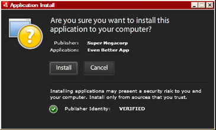
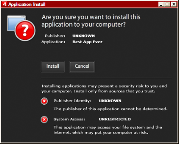

# Packaging a desktop AIR installation file

Every AIR application must, at a minimum, have an application descriptor file
and a main SWF or HTML file. Any other assets to be installed with the
application must be packaged in the AIR file as well.

This article discusses packaging an AIR application using the command-line tools
included with the SDK. For information about package an application using one of
the Adobe authoring tools, see the following:

- Adobe® Flex® Builder™, see
  [Packaging AIR applications with Flex Builder](http://livedocs.adobe.com/flex/3/html/UsingFB_1.html#1084848).

- Adobe® Flash® Builder™, see
  [Packaging AIR applications with Flash Builder](http://help.adobe.com/en_US/Flex/4.0/UsingFlashBuilder/WS6b84a753ecd210fd-7fb8a08d12114b6a4cf-8000.html#WS6b84a753ecd210fd-7fb8a08d12114b6a4cf-7ffd).

- Adobe® Flash® Professional, see
  [Publishing for Adobe AIR](http://help.adobe.com/en_US/Flash/CS5/Using/WSF0126B20-BFF4-4c50-9978-BCA47C8C3C3F.html).

<!-- -->

- Adobe® Dreamweaver® see
  [Creating an AIR application in Dreamweaver](http://help.adobe.com/en_US/Dreamweaver/CS5/Using/WS6463f310bbfa3de2-1eb2a492126f73db0f1-8000.html#WS6463f310bbfa3de2-1eb2a492126f73db0f1-7fff).

All AIR installer files must be signed using a digital certificate. The AIR
installer uses the signature to verify that your application file has not been
altered since you signed it. You can use a code signing certificate from a
certification authority or a self-signed certificate.

When you use a certificate issued by a trusted certification authority, you give
users of your application some assurance of your identity as publisher. The
installation dialog reflects the fact that your identity is verified by the
certificate authority:

Installation confirmation dialog for application signed by a trusted certificate

When you use a self-signed certificate, users cannot verify your identity as the
signer. A self-signed certificate also weakens the assurance that the package
hasn’t been altered. (This is because a legitimate installation file could be
substituted with a forgery before it reaches the user.) The installation dialog
reflects the fact that the publisher’s identity cannot be verified. Users are
taking a greater security risk when they install your application:

Installation confirmation dialog for application signed by a self-signed
certificate

You can package and sign an AIR file in a single step using the ADT `-package`
command. You can also create an intermediate, unsigned package with the
`-prepare` command, and sign the intermediate package with the `-sign` command
in a separate step.

Note: Java versions 1.5 and above do not accept high-ASCII characters in
passwords used to protect PKCS12 certificate files. When you create or export
your code signing certificate file, use only regular ASCII characters in the
password.

When signing the installation package, ADT automatically contacts a time-stamp
authority server to verify the time. The time-stamp information is included in
the AIR file. An AIR file that includes a verified time stamp can be installed
at any point in the future. If ADT cannot connect to the time-stamp server, then
packaging is canceled. You can override the time-stamping option, but without a
time stamp, an AIR application ceases to be installable after the certificate
used to sign the installation file expires.

If you are creating a package to update an existing AIR application, the package
must be signed with the same certificate as the original application. If the
original certificate has been renewed or has expired within the last 180 days,
or if you want to change to a new certificate, you can apply a migration
signature. A migration signature involves signing the application AIR file with
both the new and the old certificate. Use the `-migrate` command to apply the
migration signature as described in
[ADT migrate command](WS901d38e593cd1bac1e63e3d128fc240122-7ffd.html).

Important: There is a strict 180 day grace period for applying a migration
signature after the original certificate expires. Without a migration signature,
existing users must uninstall their existing application before installing your
new version. The grace period only applies to applications that specify AIR
version 1.5.3, or above, in the application descriptor namespace. There is no
grace period when targeting earlier versions of the AIR runtime.

Before AIR 1.1, migration signatures were not supported. You must package an
application with an SDK of version 1.1 or later to apply a migration signature.

Applications deployed using AIR files are known as desktop profile applications.
You cannot use ADT to package a native installer for an AIR application if the
application descriptor file does not support the desktop profile. You can
restrict this profile using the `supportedProfiles` element in the application
descriptor file. See
[Device profiles](WS144092a96ffef7cc16ddeea2126bb46b82f-8000.html) and
[supportedProfiles](WSfffb011ac560372f2fea1812938a6e463-7fe2.html).

Note: The settings in the application descriptor file determine the identity of
an AIR application and its default installation path. See
[AIR application descriptor files](WS5b3ccc516d4fbf351e63e3d118666ade46-7ff1.html).

#### Publisher IDs

As of AIR 1.5.3, publisher IDs are deprecated. New applications (originally
published with AIR 1.5.3 or later) do not need and should not specify a
publisher ID.

When updating applications published with earlier versions of AIR, you must
specify the original publisher ID in the application descriptor file. Otherwise,
the installed version of your application and the update version are treated as
different applications. If you use a different ID or omit the publisherID tag, a
user must uninstall the earlier version before installing the new version.

To determine the original publisher ID, find the `publisherid` file in the
META-INF/AIR subdirectory where the original application is installed. The
string within this file is the publisher ID. Your application descriptor must
specify the AIR 1.5.3 runtime (or later) in the namespace declaration of the
application descriptor file in order to specify the publisher ID manually.

For applications published before AIR 1.5.3 — or that are published with the AIR
1.5.3 SDK, while specifying an earlier version of AIR in the application
descriptor namespace — a publisher ID is computed based on the signing
certificate. This ID is used, along with the application ID, to determine the
identity of an application. The publisher ID, when present, is used for the
following purposes:

- Verifying that an AIR file is an update rather than a new application to
  install

- As part of the encryption key for the encrypted local store

- As part of the path for the application storage directory

- As part of the connection string for local connections

- As part of the identity string used to invoke an application with the AIR
  in-browser API

- As part of the OSID (used when creating custom install/uninstall programs)

Before AIR 1.5.3, the publisher ID of an application could change if you signed
an application update with migration signature using a new or renewed
certificate. When a publisher ID changes, the behavior of any AIR features
relying on the ID also changes. For example, data in the existing encrypted
local store can no longer be accessed and any Flash or AIR instances that create
a local connection to the application must use the new ID in the connection
string.

In AIR 1.5.3, or later, the publisher ID is not based on the signing certificate
and is only assigned if the publisherID tag is included in the application
descriptor. An application cannot be updated if the publisher ID specified for
the update AIR package does not match its current publisher ID.

## Packaging with ADT

You can use the AIR ADT command-line tool to package an AIR application. Before
packaging, all your ActionScript, MXML, and any extension code must be compiled.
You must also have a code signing certificate.

For a detailed reference on ADT commands and options see
[AIR Developer Tool (ADT)](WS5b3ccc516d4fbf351e63e3d118666ade46-7fd9.html).

#### Creating an AIR package

To create an AIR package, use the ADT package command, setting the target type
to _air_ for release builds.

    adt -package -target air -storetype pkcs12 -keystore ../codesign.p12 myApp.air myApp-app.xml myApp.swf icons

The example assumes that the path to the ADT tool is on your command-line
shell’s path definition. (See
[Path environment variables](WSfffb011ac560372f-71994050128cca87097-8000.html)
for help.)

You must run the command from the directory containing the application files.
The application files in the example are myApp-app.xml (the application
descriptor file), myApp.swf, and an icons directory.

When you run the command as shown, ADT will prompt you for the keystore
password. (The password characters you type are not always displayed; just press
Enter when you are done typing.)

#### Creating an AIR package from an AIRI file

You can create sign an AIRI file to create an installable AIR package:

    adt -sign -storetype pkcs12 -keystore ../codesign.p12 myApp.airi myApp.air

