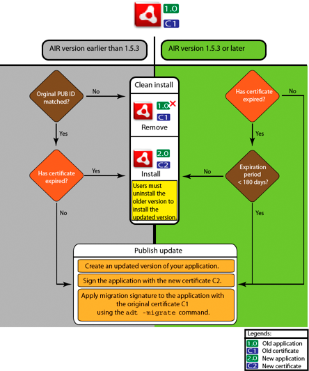

# Signing an updated version of an AIR application

Each time you create an updated version of an existing AIR application you sign
the updated application. In the best case you can use the same certificate to
sign the updated version that you used to sign the previous version. In that
case the signing is exactly the same as signing the application for the first
time.

If the certificate used to sign the previous version of the application has
expired and been renewed or replaced, you can use the renewed or new
(replacement) certificate to sign the updated version. To do this, you sign the
application with the new certificate _and_ you apply a migration signature using
the original certificate. The migration signature validates that the original
certificate owner has published the update.

Before you apply a migration signature, consider the following points:

- To apply a migration signature, the original certificate must still be valid
  or have expired within the last 365 days. This period is termed as the 'grace
  period' and the duration can change in the future.

  Note: Until AIR 2.6, the grace period was 180 days.

- You cannot apply a migration signature after the certificate expires and the
  365 days grace period elapses. In that case, users must uninstall the existing
  version before installing the updated version.

- The 365-day grace period only applies to applications specifying AIR version
  1.5.3 or higher in the application descriptor namespace.

Important: Signing updates with migration signatures from expired certificates
is a temporary solution. For a comprehensive solution, create a standardized
signing workflow to manage the deployment of application updates. For example,
sign each update with the latest certificate and apply a migration certificate
using the certificate used to sign the previous update (if applicable). Upload
each update to its own URL from which users can download the application. For
more information, see
[Signing workflow for application updates](WS8b24479264ec4228-36ce971912ccecd3180-8000.html).

The following table and figure summarize the workflow for migration signatures:

<table>
<colgroup>
<col style="width: 25%" />
<col style="width: 25%" />
<col style="width: 25%" />
<col style="width: 25%" />
</colgroup>
<thead>
<tr class="header">
<th>
Scenario
</th>
<th>
State of Original Certificate
</th>
<th>
Developer Action
</th>
<th>
User Action
</th>
</tr>
</thead>
<tbody>
<tr class="odd">
<td rowspan="3">
Application based on Adobe AIR runtime version 1.5.3
or higher
</td>
<td>
Valid
</td>
<td>
Publish the latest version of the AIR application
</td>
<td>
No action required

Application automatically upgrades
</td>
</tr>
<tr class="even">
<td>
Expired, but within 365-day grace period
</td>
<td>
Sign the application with the new certificate. Apply a migration
signature using the expired certificate.
</td>
<td>
No action required

Application automatically upgrades
</td>
</tr>
<tr class="odd">
<td>
Expired and not in grace period
</td>
<td>
You cannot apply the migration signature to the AIR application
update.

Instead, you must publish another version of the AIR application
using a new certificate. Users can install the new version after
uninstalling their existing version of the AIR application.
</td>
<td>
Uninstall the current version of the AIR application and install
the latest version
</td>
</tr>
<tr class="even">
<td rowspan="2">

<ul class="incremental">
<li>
Application based on Adobe AIR runtime version 1.5.2 or
lower
</li>
<li>
Publisher ID in the application descriptor of the update matches
publisher ID of the previous version
</li>
</ul>

</td>
<td>
Valid
</td>
<td>
Publish the latest version of the AIR application
</td>
<td>
No action required

Application automatically upgrades
</td>
</tr>
<tr class="odd">
<td>
Expired and not in grace period
</td>
<td>
You cannot apply the migration signature to the AIR application
update.

Instead, you must publish another version of the AIR application
using a new certificate. Users can install the new version after
uninstalling their existing version of the AIR application.
</td>
<td>
Uninstall the current version of the AIR application and install
the latest version
</td>
</tr>
<tr class="even">
<td>

<ul class="incremental">
<li>
Application based on Adobe AIR runtime version 1.5.2 or
lower
</li>
<li>
Publisher ID in the application descriptor of the update
<strong>does not</strong> match publisher ID of the previous
version
</li>
</ul>

</td>
<td>
Any
</td>
<td>
Sign the air application using a valid certificate and publish
the latest version of the AIR application
</td>
<td>
Uninstall the current version of the AIR application and install
the latest version
</td>
</tr>
</tbody>
</table>

Signing workflow for updates

## Migrate an AIR application to use a new certificate

To migrate an AIR application to a new certificate while updating the
application:

1.  Create an update to your application

2.  Package and sign the update AIR file with the **new** certificate

3.  Sign the AIR file again with the **original** certificate using
    the` -migrate` command

An AIR file signed with the `-migrate` command can also be used to install a new
version of the application, in addition to being used to update any previous
version signed with the old certificate.

Note: When updating an application published for a version of AIR earlier
than1.5.3, specify the original publisher ID in the application descriptor.
Otherwise, users of your application must uninstall the earlier version before
installing the update.

Use the ADT -`migrate` command with following syntax:

    adt -migrate SIGNING_OPTIONS air_file_in air_file_out

- **SIGNING_OPTIONS** The signing options identify the private key and
  certificate with which to sign the AIR file. These options must identify the
  **original** signing certificate and are described in
  [ADT code signing options](WS5b3ccc516d4fbf351e63e3d118666ade46-7f72.html).

- **air_file_in** The AIR file for the update, signed with the **new**
  certificate.

- **air_file_out** The AIR file to create.

Note: The filenames used for the input and output AIR files must be different.

The following example demonstrates calling ADT with the `-migrate` flag to apply
a migration signature to an updated version of an AIR application:

    adt -migrate -storetype pkcs12 -keystore cert.p12 myAppIn.air myApp.air

Note: The `-migrate` command was added to ADT in the AIR 1.1 release.

## Migrate a native installer AIR application to use a new certificate

An AIR application that is published as a native installer (for example, an
application that uses the native extension api) cannot be signed using the ADT
`-migrate` command because it is a platform-specific native application, not a
.air file. Instead, to migrate an AIR application that is published as a native
extension to a new certificate:

1.  Create an update to your application.

2.  Make sure that in your application descriptor (app.xml) file the
    `<supportedProfiles>` tag includes both the desktop profile and the
    extendedDesktop profile (or remove the `<supportedProfiles>` tag from the
    application descriptor).

3.  Package and sign the update application **as a .air file** using the ADT
    `-package` command with the **new** certificate.

4.  Apply the migration certificate to the .air file using the ADT `-migrate`
    command with the **original** certificate (as described previously in
    [Migrate an AIR application to use a new certificate](WS2f73111e7a180bd0-7522d02d13c2b280a60-8000.html)).

5.  Package the .air file into a native installer using the ADT `-package`
    command with the `-target native` flag. Because the application is already
    signed, you don't specify a signing certificate as part of this step.

The following example demonstrates steps 3-5 of this process. The code calls ADT
with the `-package` command, calls ADT with the the `-migrate` command, then
calls ADT with the `-package` command again to package an updated version of an
AIR application as a native installer:

    adt -package -storetype pkcs12 -keystore new_cert.p12 myAppUpdated.air myApp.xml myApp.swf
    adt -migrate -storetype pkcs12 -keystore original_cert.p12 myAppUpdated.air myAppMigrate.air
    adt -package -target native myApp.exe myAppMigrate.air

## Migrate an AIR application that uses a native extension to use a new certificate

An AIR application that uses a native extension cannot be signed using the ADT
`-migrate` command. It also can't be migrated using the procedure for migrating
a native installer AIR application because it can't be published as an
intermediate .air file. Instead, to migrate an AIR application that uses a
native extension to a new certificate:

1.  Create an update to your application

2.  Package and sign the update native installer using the ADT `-package`
    command. Package the application with the **new** certificate, and include
    the `-migrate` flag specifying the **original** certificate.

Use the following syntax to call the ADT `-package` command with the -`migrate`
flag:

    adt -package AIR_SIGNING_OPTIONS -migrate MIGRATION_SIGNING_OPTIONS -target package_type NATIVE_SIGNING_OPTIONS output app_descriptor FILE_OPTIONS

- **AIR_SIGNING_OPTIONS** The signing options identify the private key and
  certificate with which to sign the AIR file. These options identify the
  **new** signing certificate and are described in
  [ADT code signing options](WS5b3ccc516d4fbf351e63e3d118666ade46-7f72.html).

- **MIGRATION_SIGNING_OPTIONS** The signing options identify the private key and
  certificate with which to sign the AIR file. These options identify the
  **original** signing certificate and are described in
  [ADT code signing options](WS5b3ccc516d4fbf351e63e3d118666ade46-7f72.html).

- The other options are the same options used for packaging a native installer
  AIR application and are described in
  [ADT package command](WS901d38e593cd1bac1e63e3d128cdca935b-8000.html).

The following example demonstrates calling ADT with the `-package` command and
the `-migrate` flag to package an updated version of an AIR application that
uses a native extension and apply a migration signature to the update:

    adt -package -storetype pkcs12 -keystore new_cert.p12 -migrate -storetype pkcs12 -keystore original_cert.p12 -target native myApp.exe myApp.xml myApp.swf

Note: The `-migrate` flag of the `-package` command is available in ADT in AIR
3.6 and later.
