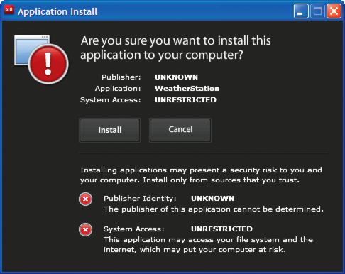

# Presenting a custom application update user interface

AIR includes a default update interface:

This interface is always used the first time a user installs a version of an
application on a machine. However, you can define your own interface to use for
subsequent instances. If your application defines a custom update interface,
specify a `customUpdateUI` element in the application descriptor file for the
currently installed application:

    <customUpdateUI>true</customUpdateUI>

When the application is installed and the user opens an AIR file with an
application ID and a publisher ID that match the installed application, the
runtime opens the application, rather than the default AIR application
installer. For more information, see
[customUpdateUI](WSfffb011ac560372f2fea1812938a6e463-7fdf.html).

The application can decide, when it is run (when the
`NativeApplication.nativeApplication` object dispatches an `load` event),
whether to update the application (using the Updater class). If it decides to
update, it can present its own installation interface (which differs from its
standard running interface) to the user.

