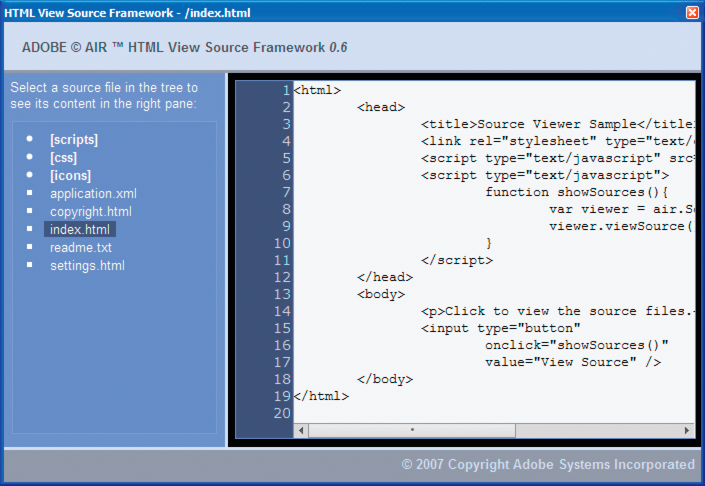

# Viewing Source Code

Just as a user can view source code for an HTML page in a web browser, users can
view the source code of an HTML-based AIR application. The Adobe® AIR® SDK
includes an AIRSourceViewer.js JavaScript file that you can use in your
application to easily reveal source code to end users.

## Loading, configuring, and opening the Source Viewer

The Source Viewer code is included in a JavaScript file, AIRSourceViewer.js,
that is included in the frameworks directory of the AIR SDK. To use the Source
Viewer in your application, copy the AIRSourceViewer.js to your application
project directory and load the file via a script tag in the main HTML file in
your application:

    

The AIRSourceViewer.js file defines a class, SourceViewer, which you can access
from JavaScript code by calling `air.SourceViewer`.

The SourceViewer class defines three methods: `getDefault()`, `setup()`, and
`viewSource()`.

| Method         | Description                                                                                                                                           |
| -------------- | ----------------------------------------------------------------------------------------------------------------------------------------------------- |
| `getDefault()` | A static method. Returns a SourceViewer instance, which you can use to call the other methods.                                                        |
| `setup()`      | Applies configuration settings to the Source Viewer. For details, see [Configuring the Source Viewer](WS5b3ccc516d4fbf351e63e3d118666ade46-7c4e.html) |
| `viewSource()` | Opens a new window in which the user can browse and open source files of the host application.                                                        |

Note: Code using the Source Viewer must be in the application security sandbox
(in a file in the application directory).

For example, the following JavaScript code instantiates a Source Viewer object
and opens the Source Viewer window listing all source files:

    var viewer = air.SourceViewer.getDefault();
    viewer.viewSource();

### Configuring the Source Viewer

The `config()` method applies given settings to the Source Viewer. This method
takes one parameter: `configObject`. The `configObject` object has properties
that define configuration settings for the Source Viewer. The properties are
`default`, `exclude`, `initialPosition`, `modal`, `typesToRemove`, and
`typesToAdd`.

#### default

A string specifying the relative path to the initial file to be displayed in the
Source Viewer.

For example, the following JavaScript code opens the Source Viewer window with
the index.html file as the initial file shown:

    var viewer = air.SourceViewer.getDefault();
    var configObj = {};
    configObj.default = "index.html";
    viewer.viewSource(configObj);

#### exclude

An array of strings specifying files or directories to be excluded from the
Source Viewer listing. The paths are relative to the application directory.
Wildcard characters are not supported.

For example, the following JavaScript code opens the Source Viewer window
listing all source files except for the AIRSourceViewer.js file, and files in
the Images and Sounds subdirectories:

    var viewer = air.SourceViewer.getDefault();
    var configObj = {};
    configObj.exclude = ["AIRSourceViewer.js", "Images" "Sounds"];
    viewer.viewSource(configObj);

#### initialPosition

An array that includes two numbers, specifying the initial x and y coordinates
of the Source Viewer window.

For example, the following JavaScript code opens the Source Viewer window at the
screen coordinates \[40, 60\] (X = 40, Y = 60):

    var viewer = air.SourceViewer.getDefault();
    var configObj = {};
    configObj.initialPosition = [40, 60];
    viewer.viewSource(configObj);

#### modal

A Boolean value, specifying whether the Source Viewer should be a modal (true)
or non-modal (false) window. By default, the Source Viewer window is modal.

For example, the following JavaScript code opens the Source Viewer window such
that the user can interact with both the Source Viewer window and any
application windows:

    var viewer = air.SourceViewer.getDefault();
    var configObj = {};
    configObj.modal = false;
    viewer.viewSource(configObj);

#### typesToAdd

An array of strings specifying the file types to include in the Source Viewer
listing, in addition to the default types included.

By default, the Source Viewer lists the following file types:

- Text files—TXT, XML, MXML, HTM, HTML, JS, AS, CSS, INI, BAT, PROPERTIES,
  CONFIG

- Image files—JPG, JPEG, PNG, GIF

  If no value is specified, all default types are included (except for those
  specified in the `typesToExclude` property).

  For example, the following JavaScript code opens the Source Viewer window
  include VCF and VCARD files:

      var viewer = air.SourceViewer.getDefault();
      var configObj = {};
      configObj.typesToAdd = ["text.vcf", "text.vcard"];
      viewer.viewSource(configObj);

  For each file type you list, you must specify "text" (for text file types) or
  "image" (for image file types).

#### typesToExclude

An array of strings specifying the file types to exclude from the Source Viewer.

By default, the Source Viewer lists the following file types:

- Text files—TXT, XML, MXML, HTM, HTML, JS, AS, CSS, INI, BAT, PROPERTIES,
  CONFIG

- Image files—JPG, JPEG, PNG, GIF

  For example, the following JavaScript code opens the Source Viewer window
  without listing GIF or XML files:

      var viewer = air.SourceViewer.getDefault();
      var configObj = {};
      configObj.typesToExclude = ["image.gif", "text.xml"];
      viewer.viewSource(configObj);

  For each file type you list, you must specify `"text"` (for text file types)
  or `"image"` (for image file types).

### Opening the Source Viewer

You should include a user interface element, such as a link, button, or menu
command, that calls the Source Viewer code when the user selects it. For
example, the following simple application opens the Source Viewer when the user
clicks a link:

    <html>
        <head>
            <title>Source Viewer Sample</title>
            
            
        </head>
        <body>
            
Click to view the source files.

            <input type="button"
                onclick="showSources()"
                value="View Source" />
        </body>
    </html>

## Source Viewer user interface

When the application calls the `viewSource()` method of a SourceViewer object,
the AIR application opens a Source Viewer window. The window includes a list of
source files and directories (on the left) and a display area showing the source
code for the selected file (on the right):

Directories are listed in brackets. The user can click a brace to expand or
collapse the listing of a directory.

The Source Viewer can display the source for text files with recognized
extensions (such as HTML, JS, TXT, XML, and others) or for image files with
recognized image extensions (JPG, JPEG, PNG, and GIF). If the user selects a
file that does not have a recognized file extension, an error message is
displayed ("Cannot retrieve text content from this filetype").

Any source files that are excluded via the `setup()` method are not listed (see
[Loading, configuring, and opening the Source Viewer](WS5b3ccc516d4fbf351e63e3d118666ade46-7c4d.html)).
